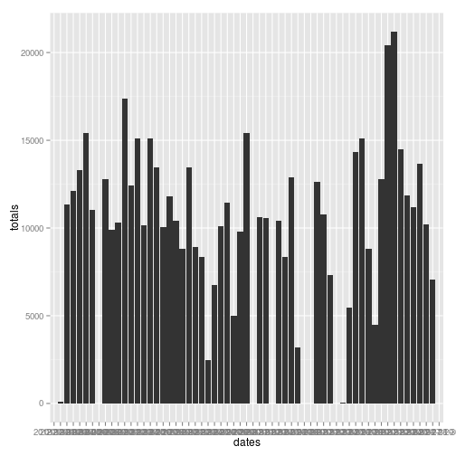
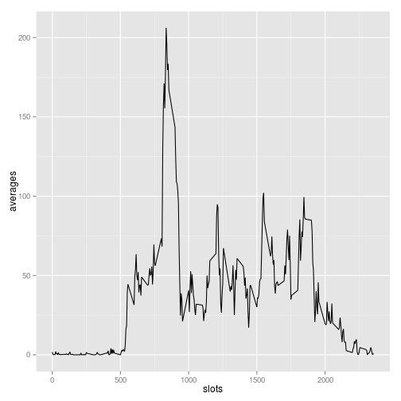
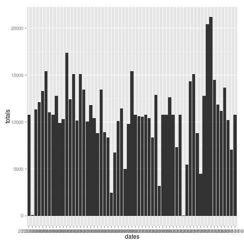

# Reproducible Research: Peer Assessment 1


## Loading and preprocessing the data


```r
library(ggplot2)
activity <- read.csv("./activity.csv", header=TRUE, colClasses=c("integer", "Date", "integer"))
```


## What is mean total number of steps taken per day?

Splitting into daily data

```r
dailyActivity <- split(activity, factor(activity$date))
```

Totals, means and medians of the step count on daily basis

```r
totals <- sapply(dailyActivity, function(x) { sum(x$steps, na.rm=TRUE)})

dates <- names(totals)
names(totals) <- NULL

means <- sapply(dailyActivity, function(x) { mean(x$steps, na.rm=TRUE)})
names(means) <- NULL

medians <- sapply(dailyActivity, function(x) { median(x$steps, na.rm=TRUE)})
names(medians) <- NULL

dailyStats <- data.frame(dates, totals, means, medians)
print(dailyStats)
```

```
##         dates totals   means medians
## 1  2012-10-01      0     NaN      NA
## 2  2012-10-02    126  0.4375       0
## 3  2012-10-03  11352 39.4167       0
## 4  2012-10-04  12116 42.0694       0
## 5  2012-10-05  13294 46.1597       0
## 6  2012-10-06  15420 53.5417       0
## 7  2012-10-07  11015 38.2465       0
## 8  2012-10-08      0     NaN      NA
## 9  2012-10-09  12811 44.4826       0
## 10 2012-10-10   9900 34.3750       0
## 11 2012-10-11  10304 35.7778       0
## 12 2012-10-12  17382 60.3542       0
## 13 2012-10-13  12426 43.1458       0
## 14 2012-10-14  15098 52.4236       0
## 15 2012-10-15  10139 35.2049       0
## 16 2012-10-16  15084 52.3750       0
## 17 2012-10-17  13452 46.7083       0
## 18 2012-10-18  10056 34.9167       0
## 19 2012-10-19  11829 41.0729       0
## 20 2012-10-20  10395 36.0938       0
## 21 2012-10-21   8821 30.6285       0
## 22 2012-10-22  13460 46.7361       0
## 23 2012-10-23   8918 30.9653       0
## 24 2012-10-24   8355 29.0104       0
## 25 2012-10-25   2492  8.6528       0
## 26 2012-10-26   6778 23.5347       0
## 27 2012-10-27  10119 35.1354       0
## 28 2012-10-28  11458 39.7847       0
## 29 2012-10-29   5018 17.4236       0
## 30 2012-10-30   9819 34.0938       0
## 31 2012-10-31  15414 53.5208       0
## 32 2012-11-01      0     NaN      NA
## 33 2012-11-02  10600 36.8056       0
## 34 2012-11-03  10571 36.7049       0
## 35 2012-11-04      0     NaN      NA
## 36 2012-11-05  10439 36.2465       0
## 37 2012-11-06   8334 28.9375       0
## 38 2012-11-07  12883 44.7326       0
## 39 2012-11-08   3219 11.1771       0
## 40 2012-11-09      0     NaN      NA
## 41 2012-11-10      0     NaN      NA
## 42 2012-11-11  12608 43.7778       0
## 43 2012-11-12  10765 37.3785       0
## 44 2012-11-13   7336 25.4722       0
## 45 2012-11-14      0     NaN      NA
## 46 2012-11-15     41  0.1424       0
## 47 2012-11-16   5441 18.8924       0
## 48 2012-11-17  14339 49.7882       0
## 49 2012-11-18  15110 52.4653       0
## 50 2012-11-19   8841 30.6979       0
## 51 2012-11-20   4472 15.5278       0
## 52 2012-11-21  12787 44.3993       0
## 53 2012-11-22  20427 70.9271       0
## 54 2012-11-23  21194 73.5903       0
## 55 2012-11-24  14478 50.2708       0
## 56 2012-11-25  11834 41.0903       0
## 57 2012-11-26  11162 38.7569       0
## 58 2012-11-27  13646 47.3819       0
## 59 2012-11-28  10183 35.3576       0
## 60 2012-11-29   7047 24.4688       0
## 61 2012-11-30      0     NaN      NA
```
Histogram of daily total steps

```r
g <- ggplot(dailyStats , aes(dates, totals))
g + geom_bar(stat="identity")
```

 

## What is the average daily activity pattern?

Splitting into 5-minute-time-slot data

```r
slotActivity <- split(activity, factor(activity$interval))
```

Average step count on slot basis across all days

```r
averages <- sapply(slotActivity, function(x) { mean(x$steps, na.rm=TRUE)})
totals <- sapply(slotActivity, function(x) { sum(x$steps, na.rm=TRUE)})

slotStats <- data.frame(slots=as.numeric(names(averages)), averages=as.vector(averages), totals=as.vector(totals))
```

Time series plot


```r
qplot(slots, averages, data=slotStats, geom="line", group=1)
```

 

Slot containing the maximum steps


```r
maxValue <- max(slotStats$totals)
slotStats[slotStats$totals == maxValue, ]
```

```
##     slots averages totals
## 104   835    206.2  10927
```


## Imputing missing values

Report of total number of missing values

```r
dataWithNA <- activity[is.na(activity$steps), ]
nrow(dataWithNA)
```

```
## [1] 2304
```

Patching NA's with the mean

```r
for( i in 1:nrow(activity)) {
    if (is.na(activity[i, "steps"])) {
        slot <- activity[i, "interval"]
        averageValue <- slotStats[slotStats$slots == slot, "averages"]
        activity[i, "updated_steps"] <- averageValue
    } else {
        activity[i, "updated_steps"] <- activity[i, "steps"]
    }
}
```

Splitting into daily data (after patching)

```r
dailyActivity <- split(activity, factor(activity$date))
```

Totals, means and medians of the step count on daily basis

```r
totals <- sapply(dailyActivity, function(x) { sum(x$updated_steps, na.rm=TRUE)})

dates <- names(totals)

means <- sapply(dailyActivity, function(x) { mean(x$updated_steps, na.rm=TRUE)})

medians <- sapply(dailyActivity, function(x) { median(x$updated_steps, na.rm=TRUE)})

dailyStatsAfterPatch <- data.frame(dates=dates, totals=as.vector(totals), means=as.vector(means), medians=as.vector(medians))
```
Histogram of daily total steps after patch

```r
g <- ggplot(dailyStatsAfterPatch, aes(dates, totals))
g + geom_bar(stat="identity")
```

 
## Are there differences in activity patterns between weekdays and weekends? 


```r
activity$weekday <- weekdays(activity$date, abbreviate=TRUE)
for(i in 1:nrow(activity)) {
    day <- activity[i, "weekday"]
    if (day %in% c("Sat", "Sun")) {
        activity[i, "dayType"] <- "weekend"
    } else {
        activity[i, "dayType"] <- "weekday"
    }
}
```

Taking averages across weekdays and weekends
